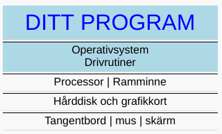

# Exempel 1

Ditt första program.

Skriv programmet i en textfil och spara filen som `main.go`

## main.go

	package main

	func main() {
		print("Hello, World!")
	}

Kör programmet genom att i terminalen skriva

    go run main.go

## Lärdom

1. källkod består av `nyckelord`, exemplet ovan har två, `package` och `func`
1. `källkod` är de textfiler som du som programerare skriver
1. `package` nyckelord som deklarerar vilket paket denna koden tillhör
1. `deklarerar` skapar eller definierar en betydelse i programmet
1. `func` nyckelordet deklarerar en funktion
1. `terminalen`, programmet som vi använder för att skicka kommandon till datorn
1. `källkoden` som skrivs i en textfil, vi döpte denna till `main.go`
1. kompilatorn `go`, verktyget som omvandlar källkoden till assembler
   som processorn förstår
1. `main` huvud funktionen i varje program om den ligger i paketet `main`
1. funktionsanrop till den inbyggda funktionen `print`
1. funktioner kan ta ett eller flera argument `"Hello, World!"`
1. en `sträng` måste skrivas med dubbelfnutt `"..."` i början och slut

## Datorn

Ditt program pratar med operativsystemet som i sin tur använder
drivrutiner för att prata med olika hårdvarukomponenter.

## Assembler

När programmet i detta exemplet kompileras konverteras det i olika
steg till en binär. Ett av stegen är att omvandla 'go' källkoden till
assembler. Ovan funktion ser ut såhär

    "".main t=1 size=81 args=0x0 locals=0x18
        0x0000 00000 (main.go:3)        TEXT    "".main(SB), $24-0
        0x0000 00000 (main.go:3)        MOVQ    (TLS), CX
        0x0009 00009 (main.go:3)        CMPQ    SP, 16(CX)
        0x000d 00013 (main.go:3)        JLS     74
        0x000f 00015 (main.go:3)        SUBQ    $24, SP
        0x0013 00019 (main.go:3)        MOVQ    BP, 16(SP)
        0x0018 00024 (main.go:3)        LEAQ    16(SP), BP
        0x001d 00029 (main.go:3)        FUNCDATA        $0, gclocals·33cdeccccebe80329f1fdbee7f5874cb(SB)
        0x001d 00029 (main.go:3)        FUNCDATA        $1, gclocals·33cdeccccebe80329f1fdbee7f5874cb(SB)

        0x001d 00029 (main.go:4)        PCDATA  $0, $0
        0x001d 00029 (main.go:4)        CALL    runtime.printlock(SB)
        0x0022 00034 (main.go:4)        LEAQ    go.string."Hello, World!"(SB), AX
        0x0029 00041 (main.go:4)        MOVQ    AX, (SP)
        0x002d 00045 (main.go:4)        MOVQ    $13, 8(SP)
        0x0036 00054 (main.go:4)        PCDATA  $0, $0
        0x0036 00054 (main.go:4)        CALL    runtime.printstring(SB)
        0x003b 00059 (main.go:4)        PCDATA  $0, $0
        0x003b 00059 (main.go:4)        CALL    runtime.printunlock(SB)

        0x0040 00064 (main.go:5)        MOVQ    16(SP), BP
        0x0045 00069 (main.go:5)        ADDQ    $24, SP
        0x0049 00073 (main.go:5)        RET
        0x004a 00074 (main.go:5)        NOP

    -- klippt här, hela programmet är egentligen större --

Inget man vill skriva för hand eller hur?

[Exempel 2](../02/README.md#exempel-2)
