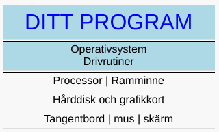

# Exempel 1

Vad tror du nedan program gör?

Skriv programmet i en textfil och döp denna till `main.go`

## main.go

	package main

	func main() {
		print("Hello, World!")
	}

Kör programmet genom att i terminalen skriva

    go run main.go
	

## Lärdom

1. källkod består av `nyckelord`, exemplet ovan har två, `package` och `func`
1. `källkod` är de textfiler som du som programerare skriver
1. `package` nyckelord som deklarerar vilket paket denna koden tillhör
1. `deklarerar` skapar eller definierar en betydelse i programmet
1. `func` nyckelordet deklarerar en funktion
1. `terminalen`, programmet som vi använder för att skicka kommandon till datorn
1. `källkoden` som skrivs i en textfil, vi döpte denna till `main.go`
1. kompilatorn `go`, verktyget som omvandlar källkoden till något som datorn förstår
1. `main` huvud funktionen i varje program om den ligger i paketet `main`
1. funktionsanrop till den inbyggda funktionen `print`
1. funktioner kan ta ett eller flera argument `"Hello, World!"`
1. en `sträng` måste skrivas med dubbelfnutt `"..."` i början och slut

## Datorn

Ditt program pratar med operativsystemet som i sin tur använder
drivrutiner för att prata med olika hårdvarukomponenter.

[Exempel 2](../exempel2/README.md)
